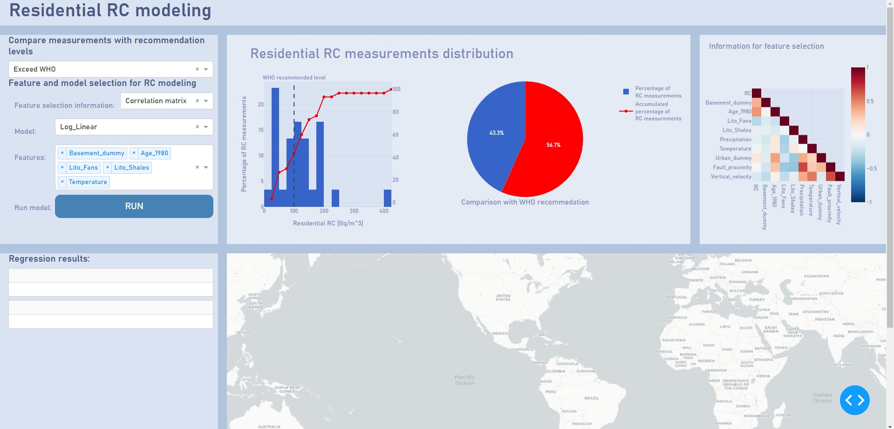
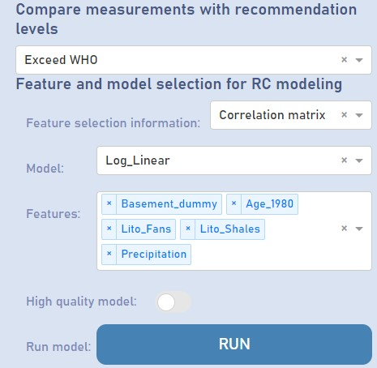
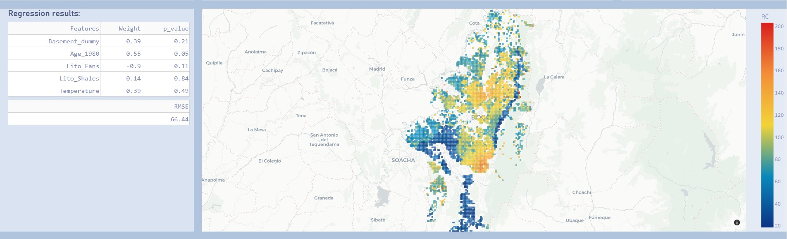

# Rn Data analysis and interactive visualization

In this repository you can find the RAW Rn data and the codes, written in `Python` pogramming language (.ipynb), that where used to analyse the RC data retrieved in the context of the publication *Indoor $^{222}$Rn  concentrations and estimated distribution in Bogotá, Colombia: Reproducible results of an exploratory study*. Additionally, a dashboard was created to make the interaction with the data more user friendly and to facilitate the replicability of this type of studies in other study areas.
  
The repository is divided three jupyter notebooks and four data folders.
- Folders:
    - Dataset for fitting
        
        Folder with the Raw data (`Raw_Results_LR115.xlsx`) used in Data distribution.ipynb and the dataset with dependent and independent variables used for fitting the regression models (`Processed_DataFrame.csv`).
        
    - Dataset for regression
        
        Folder with the cadaster data to which the regression will be applied. This dataset must have the same independent variables than the dataset used for fitting the model. **In the repository this data is zipped for storage purposes**. When the `Multivariate analysis.ipynb` is ran the dataset is unzipped.
        
    - Figures
        
        Folder with all of the figures created in the Data distribution.ipynb and Multivariate analysis.ipynb.
        
    - Regression results
        
        This folder contains the results of regressions created in the Multivariate analysis notebook or created while using the dashboard app. The regression results created while using the dashboard app can be deleted by `reseting the model environment`.
        
- Notebooks
    - Data distribution.ipynb
       
       Jupyter notebook with basic statistical analysis of the raw RC data (Raw_Results_LR115.xlsx).
       
    - Multivariate anlysis.ipynb
        
        Jupyter notebook with: 
        
        - Multivariate analysis of the processed dataset (Processed_DataFrame.csv) [correlation matrix, PCA, etc.] 
        - Fitting of RC data using predictors.
        - Perform feature selection
        - Estimate RC in the Dataset for regression (Cadastre information)
        
    - Dashboard_App.ipynb
        
        Jupyter notebook that creates a dashboard that can be used to create an interactive app for Residential RC modeling. This app will take the datasets found in **Dataset for fitting** (`Processed_DataFrame.csv`) and **Dataset for regression** (`Houses_for_Rn_estimation_Cataster.txt`). When used for a different study area, this files should be updated with the corresponding data.
    

## Publication abstract
Radon ($^{222}$Rn) is a naturally occurring gas that represents a health threat due to its causal relationship with lung cancer. Despite its potential health impacts, this is the first study conducted to determine residential radon concentrations (RC) in the Bogotá region, and only the third in Colombia. This study aims to contribute to the bridging of the baseline information gap present in Colombia and similar countries where RC measurements and research are scarce, by using simple inferential statistics methods to estimate RC spatial distribution. The RC were measured during 35 days in 30 houses using Alpha-track detectors (LR-115). Samples were processed by the FINUAS laboratory at UPTC university. RC presented a geometric mean of 91 $\pm\text{ }14\%$ Bq/m$^3$ and a maximum concentration of 407 Bq/m$^3$. RC found in this study are the highest reported in the country and exceed the mean values of 58.33\% of similar studies in Latin America. In 56.66\% of the residences RC exceeded the WHO's recommendation of 100 Bq/m$^3$. Using a log-linear regression model, the age of the house presented a marginally significant positive association with RC. According to the model, RC measured in houses built before 1980 could increase by 77.28\% compared to those built after 1980 $(\textit{p-value} = 0.056)$. This regression model was used to create a prediction map, that showed higher RC in the oldest areas of Bogotá. This was explained by an increase of cracks that could enhance gas migration in older houses. Despite the analytical limitations, this exploratory study highlights the importance of expanding $^{222}$Rn studies in Colombia.

## Data distrbution code (Data distribution.ipynb)

This Jupyter notebook reads the RAW data (`Raw_Results_LR115.xlsx`) and create graphs for easier visualization and comparison with recommended levels and previous measurements in Latin America and the Caribbean (LAC) region.

## Multivariate analysis code (Multivariate analysis.ipynb)

This Jupyter notebbok uses the information of the RC data (Dependent variable) and the independent variables (`Processed_DataFrame.csv`) to fit one log-linear regression model. 
 
Subsequently, this notebook uses the data of Bogotá's cadastre to apply the regression model on all the houses with information of the independent variables (Information taken from Bogotá's cadaster). The data is rasterize using `GDAL` tools. 
 
The outputs of this model are:
- Figures:
    - Variable caracterization figure (`Figures/Caracterization.png`)
    - Principal component biplot figure (`Figures/PCA_RC.png`)
    - Percent change calculated for all independent variables (`Figures/Regresión_LogLineal.png`)
    - Percent change calculated for independent variables after feature selection (`Figures/Regresión_LogLineal_withFeatureSel.png`)
    - Residential RC estimated distribution (`Figures/Estimated_Rn_Histogram.png`)
- Files (To Regression results):
    - RC estimated for each house in cadaster information `LinReg_model_results.csv`.
    - Raster with RC regression results (`Log_Linear_estimations.tif`)
    
## Dashboard app (Dashboard_App.ipynb)

This Jupyter notebook creates an interactive app for residential RC modeling:

    
    
    Initial display of Dashboard app.

### "Under the hood" data input
The app uses the files in `Dataset for fitting` and `Dataset for regression` folders. These files can be changed for different study areas to perform the same analysis in different study areas or with different RC measurements.

### User inputs
While using the app, the user is able to decide:

    
    
    User inputs in Dashboard app.

- The reference level to compare its dataset
    - World Health Organization (WHO)
    - US Environmental Protection Agency (EPA)
- The type of visualization to help him decide which features will be selected for the regression
    - Correlation matrix (Low correlation values with RC and highly correlated pairs of independent variables are not suggested)
    - Variance inflation factor (VIFs above 4 are not suggested)
- The type of regression model to be used for fitting and estimating RC
    - Log-linear regression
    - Random Forest regression
- Features to be used in the fitting and estimation of RC
    - The variables here are the same ones in `Processed_DataFrame.csv`.
    
### Data analysis
Two windows display information for the analysis of the data. The first one shows a histogram and a pie plot of the RC measured (`Processed_DataFrame.csv`). The second one shows 

### Modeling results
When models are run with the app. They are displayed in the map and the tables on the left.

    
    
    Regression results presented in Dashboard.

#### Advanced modeling settings
If some advanced modelling settings need to be changed, this can be done in the `EstimatingValues` and `rasterize` functions that are defined. Here the user can change:
- Number of cells for cadaster aggregation in the horizontal component (`width_of_cells_for_aggregation`)
- Resolution of cells of raster created (`res`)
- Coordinate reference systerm (`crs`)

#### Reset modeling environment
For optimizing the app performance the estimated values of RC are saved in the `Regression results` folder.

# Important notes
To run all of the codes and deploy the dashboard app all libaries used need to be installed in your modelling envionment. For some Geospatial analysis the `GDAL` library is used. Follow the instructions in [here](https://opensourceoptions.com/blog/how-to-install-gdal-for-python-with-pip-on-windows/)

